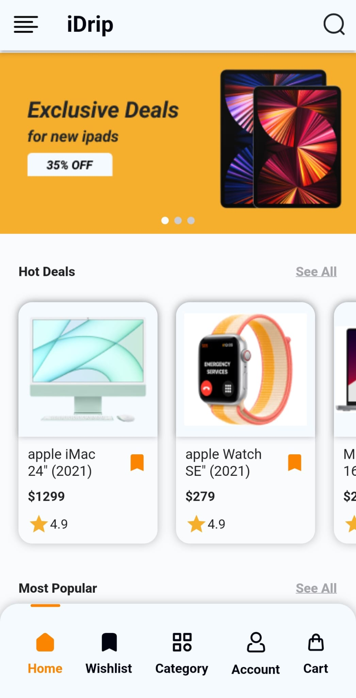
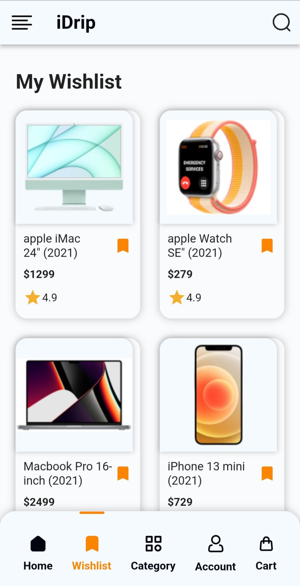
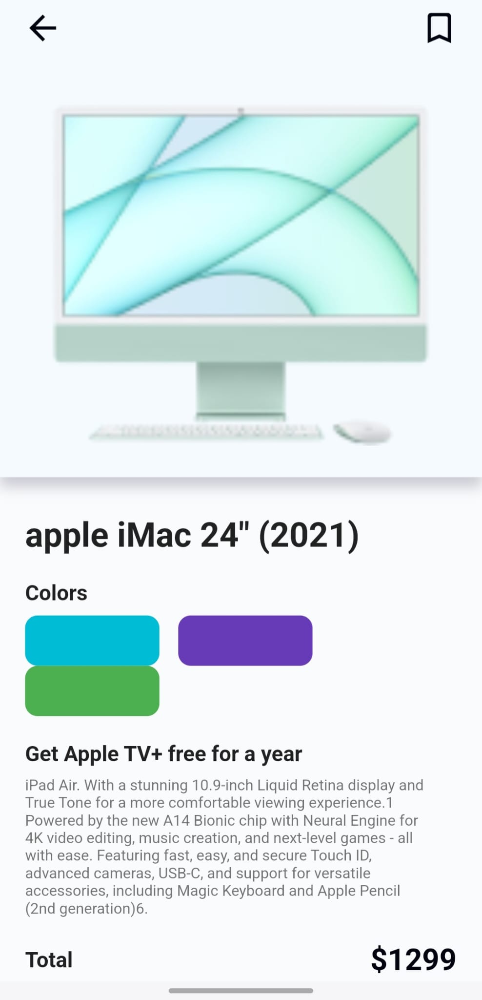
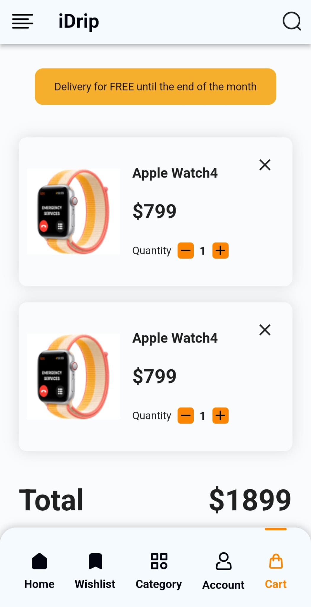

# i-Drip Mobile Application

## Overview

**i-Drip** is a mobile e-commerce application designed based on the public design of the i-Drip platform. It brings the seamless shopping experience of i-Drip into the hands of users, allowing them to browse, select, and purchase products effortlessly.

## Key Features

- **Home Screen**: The home screen provides users with an intuitive and clean interface to explore featured products and latest deals.
  
  

- **Product List**: Easily browse through a curated list of products, categorized for a smooth shopping experience.

  

- **Product Details**: Dive into product specifics with detailed descriptions, images, and customer reviews to make informed purchasing decisions.
  
  

- **Cart Management**: Manage your shopping cart efficiently, with options to add, remove, or update products before proceeding to checkout.

  

## User Experience

The i-Drip mobile application offers a sleek and minimalistic design that prioritizes user experience. Every feature, from browsing to checkout, is optimized for mobile devices to ensure a fast and intuitive shopping process.

---

## Contact

For more information or inquiries, feel free to reach out!

---

Thank you for exploring the **i-Drip Mobile Application**!

---

---

# i-Drip Mobil Uygulaması

## Genel Bakış

**i-Drip**, i-Drip platformunun public tasarımı baz alınarak tasarlanan bir mobil e-ticaret uygulamasıdır. Kullanıcıların ürünleri kolayca inceleyip satın almasını sağlayarak sorunsuz bir alışveriş deneyimi sunar.

## Öne Çıkan Özellikler

- **Anasayfa**: Kullanıcı dostu arayüzüyle öne çıkan anasayfa, öne çıkan ürünleri ve en son fırsatları keşfetmeyi sağlar.
  
  

- **Ürün Listesi**: Ürünlerin kategorize edilmiş şekilde sunulduğu, kolayca gezinebileceğiniz bir ürün listesi sunar.

  

- **Ürün Detayları**: Ürünler hakkında detaylı bilgilere, görsellere ve müşteri yorumlarına erişerek bilinçli alışveriş yapabilirsiniz.
  
  

- **Sepet Yönetimi**: Sepetinize ürün ekleyip çıkarabilir, ürünleri güncelleyebilir ve ödeme adımına geçmeden önce alışverişinizi kolayca yönetebilirsiniz.

  

## Kullanıcı Deneyimi

i-Drip mobil uygulaması, kullanıcı deneyimini ön planda tutan sade ve minimal bir tasarıma sahiptir. Ürün gezintisinden ödeme işlemine kadar her özellik mobil cihazlar için optimize edilmiştir, böylece hızlı ve sezgisel bir alışveriş süreci sunar.

---

## İletişim

Daha fazla bilgi almak veya sorularınız için bizimle iletişime geçebilirsiniz!

---

**i-Drip Mobil Uygulaması'nı** incelediğiniz için teşekkürler!
